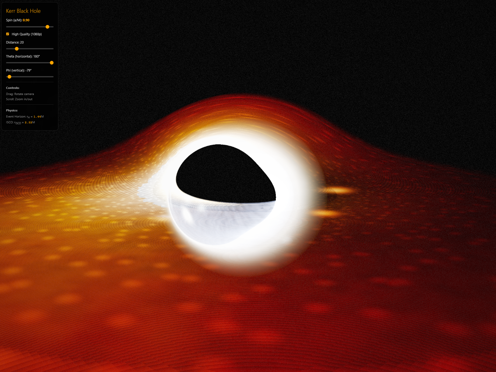

# Kerr Black Hole Simulation

A photorealistic, real-time black hole visualization built with Rust, WebAssembly, and WebGPU. Inspired by the Gargantua black hole from *Interstellar*.



## Features

- **Kerr (rotating) black hole** - Accurate spacetime geometry with frame dragging
- **Real-time ray tracing** - GPU compute shader with RK4 geodesic integration
- **Relativistic effects**:
  - Gravitational lensing and light bending
  - Doppler beaming (approaching side brighter)
  - Gravitational redshift
  - Photon sphere and Einstein ring
- **Photorealistic accretion disk**:
  - Blackbody temperature gradient
  - Orbiting hot spots
  - Voronoi-based particle clumping
  - Spiral density waves
  - Dust lanes
  - Volumetric thickness
- **Cinematic post-processing**:
  - ACES filmic tone mapping
  - Film grain
  - Bloom effect
- **Interactive controls**:
  - Mouse drag to orbit camera
  - Scroll to zoom
  - Adjustable spin parameter (0 to 0.99)
  - Resolution toggle (720p/1080p)

## Tech Stack

- **Rust** - Systems programming language
- **wgpu** - Cross-platform WebGPU implementation
- **WGSL** - WebGPU Shading Language for compute shaders
- **wasm-bindgen** - Rust/JavaScript interop
- **wasm-pack** - WASM build tooling

## Building

### Prerequisites

```bash
# Install Rust
curl --proto '=https' --tlsv1.2 -sSf https://sh.rustup.rs | sh

# Install wasm-pack
cargo install wasm-pack

# Add WASM target
rustup target add wasm32-unknown-unknown
```

### Build & Run

```bash
# Build WASM module
wasm-pack build --target web --release

# Serve locally (Python)
python3 -m http.server 8080

# Or use any static file server
npx serve .
```

Then open http://localhost:8080 in a WebGPU-compatible browser (Chrome 113+, Edge 113+, Firefox Nightly).

## Physics

The simulation implements Kerr black hole geodesics using:

- **Boyer-Lindquist coordinates** for the rotating black hole metric
- **RK4 integration** for photon trajectories with adaptive step sizing
- **ISCO calculation** - Innermost Stable Circular Orbit depends on spin
- **Frame dragging** - Space itself rotates near the black hole

Key equations:
- Event horizon: $r_H = M + \sqrt{M^2 - a^2}$
- Photon sphere: $r_{ph} \approx 1.5(1 + \sqrt{1 - a^2/2})$
- ISCO: $r_{ISCO} = 3 + Z_2 - \sqrt{(3-Z_1)(3+Z_1+2Z_2)}$

## Controls

| Control | Action |
|---------|--------|
| Left mouse drag | Rotate camera |
| Scroll wheel | Zoom in/out |
| Spin slider | Adjust black hole spin (a/M) |
| Quality toggle | Switch 720p/1080p |

## Browser Requirements

Requires WebGPU support:
- Chrome 113+ (recommended)
- Edge 113+
- Firefox Nightly (with `dom.webgpu.enabled`)
- Safari 18+ (macOS Sequoia)

## License

MIT